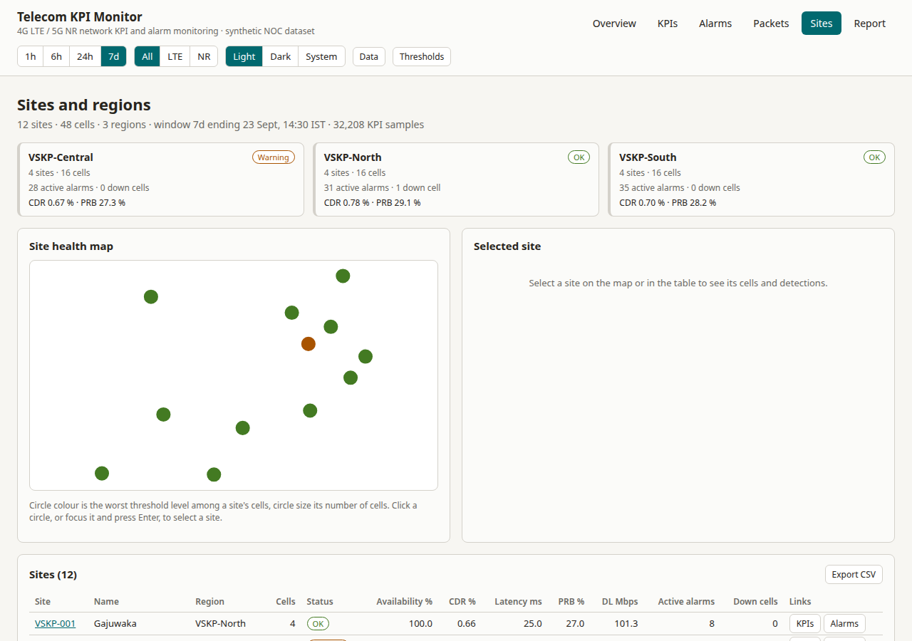
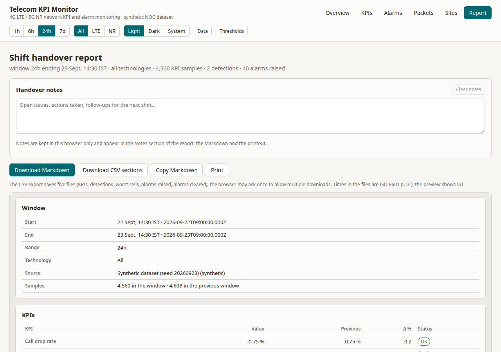
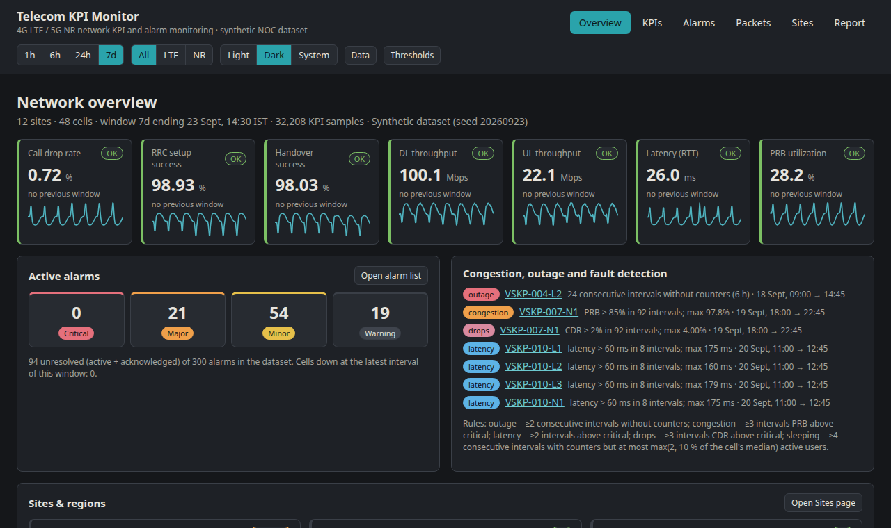

# Telecom KPI Monitor

NOC-style dashboard for **4G LTE / 5G NR radio network KPIs, alarms, sites and packet statistics**, built with Vite + React 18 + TypeScript + Recharts and hosted as a static site.

**Live:** https://telecom-kpi-monitor.vercel.app · **Repo:** https://github.com/D-L-Narayana/telecom-kpi-monitor

Everything runs client-side. Out of the box the app uses a **synthetic, seeded dataset** (12 sites, 48 cells, 7 days of 15-minute KPI samples = 32,256 rows, 300 alarms, one protocol-hierarchy table); through the **Data** drawer you can load your own KPI / cell / site / alarm export in the same schema and run every page on it. No live OSS/NMS is connected; the point of the project is the analysis workflow a network analyst uses every shift — KPI trends against thresholds, worst-cell ranking, fault/congestion detection, alarm handling with correlation and an audit trail, site health, CSV/Markdown reports and a Wireshark-style protocol breakdown.


## Features

| Page | What it does |
| --- | --- |
| **Overview** | Global time range (1h / 6h / 24h / 7d) and technology filter (All / LTE / NR), both kept in the URL. Seven KPI cards — call drop rate, RRC setup success, handover success, DL/UL throughput, latency (user-plane RTT), PRB utilization — each with the network-wide value, delta vs the previous window, threshold status and a sparkline (hourly for 7d). Active alarms by severity (click → filtered alarm list). **Congestion / outage / fault / sleeping-cell detection** panel (rule-based, see below). Region tiles linking to the Sites page. Worst-10-cells table ranked by call drop rate. |
| **KPIs** | Per-cell time series for any of 9 KPIs with warning/critical threshold lines, warning band and breach markers; compare overlay against another cell, a site mean or the network, aligned by timestamp; hourly aggregation and a brush for 7-day views; network-wide series; per-cell performance table (sortable, availability column, "only breaching" and site filters, colour-coded breaches); **CSV export** of the cell's raw 15-minute samples and of the per-cell **network performance report**. Deep links: `#/kpis?cell=VSKP-007-N1&kpi=prbUtilizationPct&range=7d`; invalid parameters fall back with a notice instead of a blank page. |
| **Alarms** | 300 alarms with URL-synced filters (severity, state, site, free text), sortable columns, 50-row pages and keyboard row navigation; CSV export (`alarms.csv`, including the correlation verdict, score and KPI per alarm). **Acknowledge / Clear / Reopen** with optional notes, bulk acknowledge of the filtered list, all persisted in `localStorage` with an **audit trail** (exportable as `alarm-audit.csv`). **Explain panel**: the affected cell's (or site's) most relevant KPI from 2 h before the alarm to 2 h after clearance with raise/clear markers, plus a **correlation verdict** (baseline vs during vs after, peak, breach fraction, score) that tells you whether the KPI actually degraded with the alarm. |
| **Sites** | Pure-SVG **site health map** from the dataset's coordinates (keyboard-focusable sites, colour by worst threshold level, size by cell count), region roll-up tiles that filter the view (worst level, cells, active alarms, CDR/PRB), a detail panel for the selected site with its cells and an alarm link, and a sortable per-site table (worst-first on first click) with availability, KPIs, active alarms and down cells; CSV export of the table; links into KPIs (worst cell first) and site-filtered alarms. Region, site and sort live in the URL. |
| **Report** | One-click **shift handover report** for the current window (`#/report?range=&tech=`): KPIs with deltas and status, detections, worst cells, alarm counts and raised/cleared lists (the preview and the Markdown show at most 25 alarms per list, the CSV holds all of them), free-text handover notes kept in the browser. Download as Markdown or as five CSV sections, copy the Markdown, or print. Files are named `shift-report_<YYYYMMDD-HHMM>_<range>_<tech>[_<section>].md|csv`; times inside them are ISO 8601 UTC. |
| **Packets** | Protocol hierarchy (GTP-U → TCP/UDP → RTP/DNS, SCTP → S1AP/NGAP, ICMP) with packet and byte shares, bytes-by-protocol bar chart, top-20 conversations, TCP retransmission rate and RTT tiles as QoS indicators. **Load your own capture export**: `tshark -T json`, `tshark -z io,phs`, `tshark -T fields -e frame.protocols -e frame.len` or a Wireshark "Export Packet Dissections → As CSV" file is parsed in the browser (nothing is uploaded, 50 MB limit) into a real protocol hierarchy built from `frame.protocols` — link-layer and padding tokens are dropped, tunnelled layers are kept apart (`ip (in gtp)`), roots sum to the frame count — with TCP retransmissions where the export carries analysis data and conversations from tshark JSON and Wireshark CSV. Files can be dropped onto the card; parser warnings (missing columns, unknown time formats) are listed next to the result. Exports: `Hierarchy CSV` (`protocol,parent,packets,bytes,retransmissions`) and `Conversations CSV`. A dataset imported without packet statistics shows an empty state with the same loader. |
| **Data drawer** | Load a KPI 15-minute CSV plus optional `cells`, `sites` and `alarms` files (the format `npm run gen:data` writes — see [`docs/DATA_SCHEMA.md`](docs/DATA_SCHEMA.md)). Files are parsed in the browser (nothing is uploaded); rows are validated with line-level errors and warnings; cells and sites are inferred from cell ids when not supplied; a sample CSV can be downloaded. Limits: 500,000 KPI rows and 100 MB per file. Imported data is held in memory only. |
| **Thresholds drawer** | Editable warning/critical thresholds per KPI (direction-aware: success rates and throughput breach *below*, drop rate, latency and PRB breach *above*) with validation (finite numbers, warning before critical in the breach direction — an emptied field no longer silently becomes 0), presets (default / strict / lenient), JSON import/export and reset. Saved in the browser and re-validated on load. The JSON file (`kpi-thresholds.json` on export) maps each KPI key to `{ "warning": n, "critical": n, "direction": "above" | "below" }`; unknown keys are dropped and missing ones filled from the defaults. |
| **Theme** | Light / dark / system, remembered per browser. |

### Detection rules (Overview → "Congestion, outage and fault detection")

| Kind | Rule (over the selected window) |
| --- | --- |
| outage | ≥ 2 consecutive 15-min intervals with no counters (all KPIs null) |
| congestion | ≥ 3 intervals with PRB utilization above the critical threshold (default 85 %) |
| latency | ≥ 2 intervals with latency above the critical threshold (default 60 ms) |
| drops | ≥ 3 intervals with call drop rate above the critical threshold (default 2 %) |
| sleeping | counters present but active users ≤ max(2, 10 % of the cell's median) for ≥ 4 consecutive intervals |

### Alarm ↔ KPI correlation (Alarms → Explain panel)

For the alarm's cell(s) and the KPI implied by its probable cause (e.g. "High PRB utilization" → PRB, "Transmission link degraded" → latency, "VSWR high" → RSRP; free-text causes from imported feeds are matched by keyword), the app compares the **baseline** (2 h before the alarm), the **during** window (raise → clear or now) and the **after** window (2 h after clearance). The **peak** is the worst hourly mean within the first 2 h after the raise. The score is 0.6 × the direction-aware peak change against the baseline (capped at +50 %) + 0.4 × the fraction of "during" intervals breaching the warning or critical threshold; a cell with ≥ 2 intervals without counters scores as a confirmed outage. dB-scale KPIs (RSRP, SINR) are compared as power ratios. Verdicts: *strong* (≥ 0.5), *weak* (≥ 0.2), *none*, or *insufficient* when there is no baseline. On the synthetic dataset the four injected incidents are *strong* and about 92 % of the 296 random alarms are not.

### KPI formulas and default thresholds

- CDR % = dropped / (dropped + completed) × 100 · RRC setup success % = successful / attempts × 100 · Handover success % = successful HOs / attempts × 100 · PRB utilization % = used / available PRBs × 100 · latency = user-plane RTT (ms) · throughput = DL/UL MAC throughput (Mbps) · availability % = intervals with counters / intervals in the window × 100.
- Network-wide values are **active-user-weighted means** for ratio KPIs and latency, plain means for throughput and PRB.

| KPI | Warning | Critical |
| --- | --- | --- |
| Call drop rate | > 1.0 % | > 2.0 % |
| RRC setup success | < 98 % | < 95 % |
| Handover success | < 97 % | < 94 % |
| Latency | > 40 ms | > 60 ms |
| DL throughput (LTE / NR) | < 15 / < 80 Mbps | < 8 / < 40 Mbps |
| UL throughput | < 4 Mbps | < 2 Mbps |
| PRB utilization | > 70 % | > 85 % |

## Screenshots

| KPI analysis — congestion on VSKP-007-N1 (PRB with threshold lines and breach markers) | Cell outage on VSKP-004-L2 (no counters for 6 h) |
| --- | --- |
|  |  |

| Alarm and fault tracking with the Explain panel | Packet statistics |
| --- | --- |
|  |  |

| Sites and regions (site health map) | Shift handover report |
| --- | --- |
|  |  |

| Overview, dark theme, 7-day window |
| --- |
|  |

## URL scheme and browser storage

Routing is hash-based, so every view is a shareable link: `#/<page>?range=1h|6h|24h|7d&tech=All|LTE|NR&…`

| Page | Extra parameters |
| --- | --- |
| `#/kpis` | `cell`, `kpi`, `compare` (cell id, `site:<SITE>` or `network`), `bucket=1h` (hourly aggregation on 7-day views) |
| `#/alarms` | `severity`, `state`, `site`, `q`, `alarm` (selected alarm), `sort`, `dir`, `page` |
| `#/sites` | `region` (filter), `site` (selected site), `sort` (`site`, `name`, `region`, `cells`, `status`, `availability`, `cdr`, `latency`, `prb`, `dl`, `alarms`, `down`), `dir` (`asc`, `desc`; the first click on a column sorts worst-first) |

`range` and `tech` are read on every page; invalid values are ignored and the app falls back to the last used filters (`tkm.filters.v1`), then to the defaults 24h / All. Other invalid parameters (unknown cell, KPI, severity, page …) fall back to defaults with a notice instead of a blank page.

`localStorage` keys: `tkm.filters.v1` (range/tech), `tkm.thresholds.v1`, `tkm.alarms.v2` (acknowledge/clear/reopen overrides + audit trail for the synthetic dataset; a v1 store is migrated), `tkm.theme.v1`, `tkm.report.notes.v1`. Imported datasets are held in memory only, and alarm actions taken on them last for the session — they are never written to `tkm.alarms.v2`, so demo acknowledgements cannot leak onto your own alarm ids.

## Synthetic dataset

`src/lib/synthetic.ts` regenerates the same data on every page load (mulberry32 PRNG, seed `20260923`), so the app needs no backend and no multi-MB JSON bundle. `npm run gen:data` writes the same dataset to `data/` (`sites.json`, `cells.json`, `alarms.json|csv`, `packet_stats.json`, `kpi_15min.csv`) for use in SQL / pandas, and `npm run check:data` verifies that the generator still reproduces the committed files byte for byte.

- 12 sites named after Visakhapatnam localities, 3 regions; per site 3 LTE cells (B3 / B40 / B1, 20 MHz, azimuths 0/120/240°) + 1 NR cell (n78, 100 MHz).
- Daily traffic curve peaking 19:00–22:00 IST; PRB follows the curve; latency and CDR rise with load; throughput falls with load; 5 % Gaussian noise.
- Injected incidents (dataset "now" = 23 Sep 2026 14:30 IST):
  1. **Cell outage** — `VSKP-004-L2` down 18 Sep 09:00–15:00 → Critical "Cell down", KPIs null for 24 intervals.
  2. **Congestion** — `VSKP-007-N1` PRB 90–98 % every evening 18:00–23:59 on 19–22 Sep, CDR 3–4 % → Major "High PRB utilization" (active).
  3. **Transmission fault** — site `VSKP-010` latency 120–180 ms on 20 Sep 11:00–13:00 → Major "Transmission link degraded".
  4. **Antenna fault** — `VSKP-002-L1` RSRP −12 dB, handover success ≈ 88 % from 21 Sep → Minor "VSWR high" (acknowledged).
- 296 further random alarms (battery, door, temperature, sleeping cell, mains, GPS sync, backhaul packet loss, …): 70 % cleared, 20 % active, 10 % acknowledged.
- Packet statistics: a synthetic S1-U / N3 capture of ≈ 0.91 M frames / 1.3 GB, TCP retransmission rate 0.8 %.

## Run locally

```bash
git clone https://github.com/D-L-Narayana/telecom-kpi-monitor.git && cd telecom-kpi-monitor
npm install
npm run dev            # http://localhost:5173
npm test               # Vitest (jsdom): KPI math, detection, sites, correlation, alarm store, thresholds, importers, parsers, report, components
npm run lint           # ESLint: TypeScript, React hooks, jsx-a11y
npm run typecheck      # tsc on src/        ·  npm run typecheck:tests  # tsc on tests, e2e, scripts, configs
npm run build          # tsc --noEmit && vite build -> dist/
npm run test:e2e       # Playwright workflows against `vite preview` of dist/ with the production security headers
                       # (build first; if port 4173 is taken: E2E_PORT=4174 npm run test:e2e)
npm run check:data     # regenerate the dataset to a temp dir and diff it against data/
npm run gen:data       # export the dataset to data/
```

## Security headers

`vercel.json` sets a Content-Security-Policy (`default-src 'self'; script-src 'self'; style-src 'self' 'unsafe-inline'; img-src 'self' data:; font-src 'self'; connect-src 'self'; object-src 'none'; base-uri 'self'; frame-ancestors 'none'; form-action 'self'`) together with `X-Content-Type-Options`, `Referrer-Policy`, `Permissions-Policy` and `X-Frame-Options`. `vite preview` serves the same headers (see `vite.config.ts`), and the end-to-end suite asserts them on the index and compiled assets while recording any CSP violation, so the production bundle is exercised exactly as deployed.

## Project layout

```
src/
  App.tsx            shell: nav, global time-range / technology filters, theme toggle, Data + Thresholds drawers
  state.tsx          dataset source (synthetic | imported), URL-synced filters, thresholds, alarm store, hash router
  lib/router.ts      page ids, hash parsing, parameter validation
  lib/synthetic.ts   seeded dataset generator (sites, cells, KPI samples, incidents, alarms, packet stats)
  lib/kpi.ts         KPI formulas, weighted aggregation, per-cell aggregates, availability, rule-based detection
  lib/sites.ts       site / region aggregates and map projection
  lib/correlation.ts alarm <-> KPI correlation scoring      lib/alarmStore.ts  acknowledge / clear / reopen with audit trail
  lib/thresholds.ts  direction-aware thresholds, validation, presets, persistence
  lib/importers.ts   CSV / JSON dataset import              lib/csv.ts         RFC 4180 parse + export
  lib/pcap.ts        tshark JSON / phs / fields and Wireshark CSV parsers
  lib/report.ts      shift report model -> Markdown / CSV
  theme/             light / dark / system theme             components/        KpiCard, KpiChart, drawers, SiteMap, ui primitives
  pages/             Overview, Kpis, Alarms, Packets, Sites, Report
tests/               Vitest unit + component tests (jsdom), fixtures
e2e/                 Playwright workflows, header assertions, axe scan
scripts/             generate-synthetic-data.mjs, check-data-determinism.mjs, check-no-skips.mjs
docs/                DATA_SCHEMA.md, ARCHITECTURE.md, CONTRIBUTING.md, screenshots/
```

## Limitations / not built

- No live data sources (SolarWinds, NetAct, Prometheus …), no authentication, no backend; acknowledge/clear state, thresholds, theme and report notes live only in the browser, and imported datasets only in memory.
- The packet page parses **exports** (`tshark -T json`, `tshark -z io,phs`, `tshark -T fields`, Wireshark CSV), not raw `.pcap` files.
- The site map is a schematic projection of the dataset coordinates, not a tiled map.

## License

MIT
