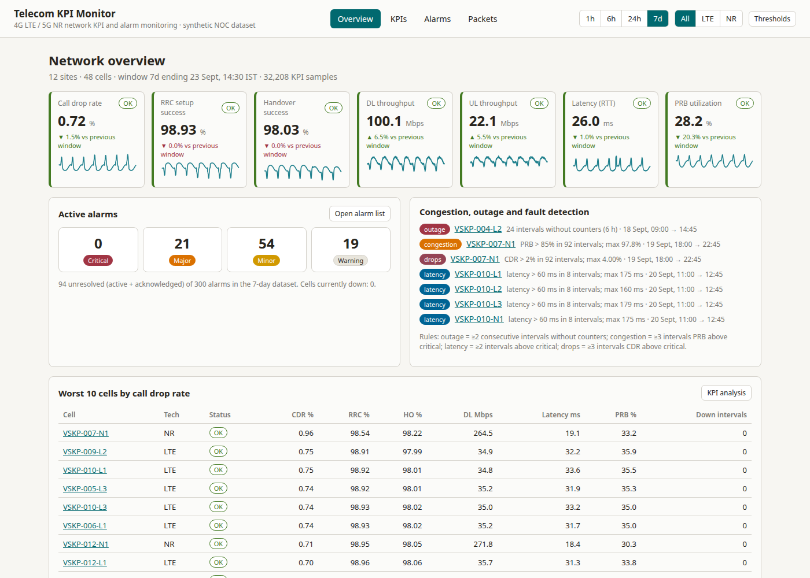
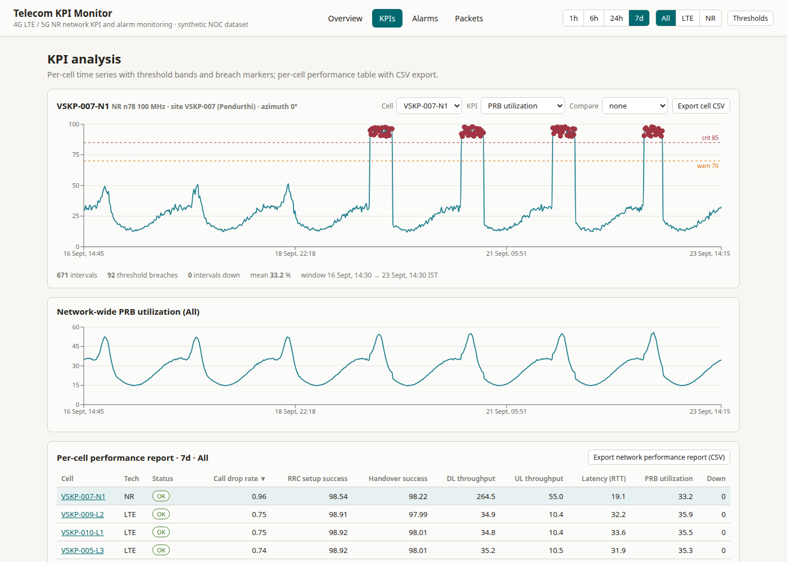
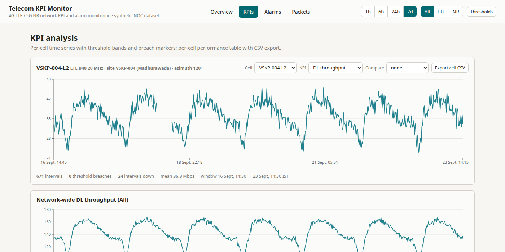
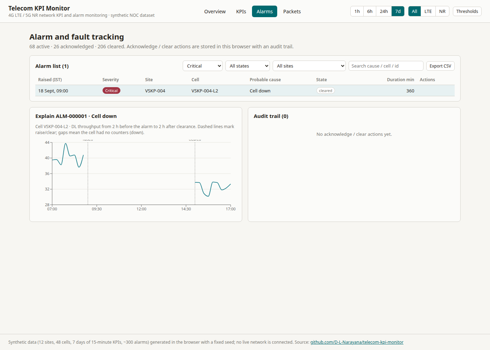
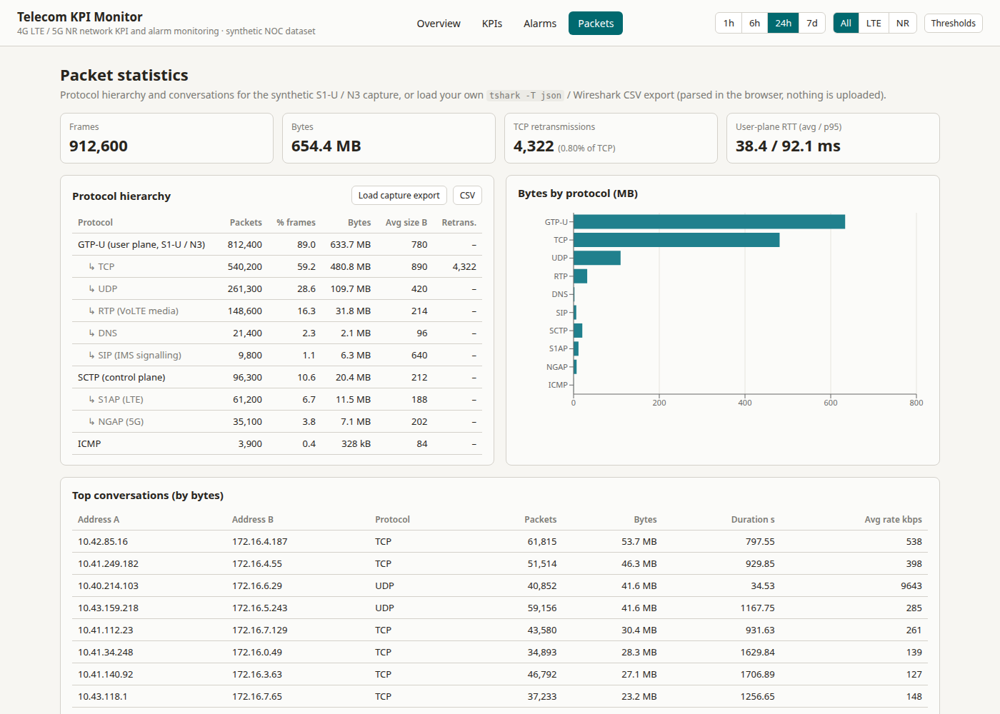

# Telecom KPI Monitor

NOC-style dashboard for **4G LTE / 5G NR radio network KPIs, alarms and packet statistics**, built with Vite + React 18 + TypeScript + Recharts and hosted as a static site.

**Live:** https://telecom-kpi-monitor.vercel.app · **Repo:** https://github.com/D-L-Narayana/telecom-kpi-monitor

Everything runs client-side on a **synthetic, seeded dataset** (12 sites, 48 cells, 7 days of 15-minute KPI samples = 32,256 rows, 300 alarms, one protocol-hierarchy table). No live OSS/NMS is connected; the point of the project is the analysis workflow a network analyst uses every shift — KPI trends against thresholds, worst-cell ranking, fault/congestion detection, alarm handling with an audit trail, CSV performance reports and a Wireshark-style protocol breakdown.



## Features

| Page | What it does |
| --- | --- |
| **Overview** | Global time range (1h / 6h / 24h / 7d) and technology filter (All / LTE / NR). Seven KPI cards — call drop rate, RRC setup success, handover success, DL/UL throughput, latency (user-plane RTT), PRB utilization — each with the network-wide value, delta vs the previous window, threshold status and a sparkline. Active alarms by severity (click → filtered alarm list). **Congestion / outage / fault detection** panel (rule-based, see below). Worst-10-cells table ranked by call drop rate. |
| **KPIs** | Per-cell time series for any of 9 KPIs with warning/critical threshold lines and red breach markers; cell-vs-cell compare overlay; network-wide series; per-cell performance table (sortable, colour-coded breaches); **CSV export** of the cell's raw 15-minute samples and of the per-cell **network performance report**. Deep links: `#/kpis?cell=VSKP-007-N1&kpi=prbUtilizationPct`. |
| **Alarms** | 300 alarms with filters (severity, state, site, free text) and CSV export. **Acknowledge / Clear** actions persisted in `localStorage` with an **audit trail**. **Explain panel**: selecting an alarm plots the affected cell's (or site's) most relevant KPI from 2 h before the alarm to 2 h after clearance, with raise/clear markers — so the fault ↔ KPI-degradation correlation is visible (e.g. throughput gap during a "Cell down" alarm). |
| **Packets** | Protocol hierarchy (GTP-U → TCP/UDP → RTP/DNS, SCTP → S1AP/NGAP, ICMP) with packet and byte shares, bytes-by-protocol bar chart, top-20 conversations, TCP retransmission rate and RTT tiles as QoS indicators. **Load your own capture export**: `tshark -T json` output or a Wireshark "Export Packet Dissections → As CSV" file is parsed in the browser into the same protocol table. |
| **Thresholds drawer** | Editable warning/critical thresholds per KPI (direction-aware: success rates and throughput breach *below*, drop rate, latency and PRB breach *above*), saved in the browser, reset to defaults. |

### Detection rules (Overview → "Congestion, outage and fault detection")

| Kind | Rule (over the selected window) |
| --- | --- |
| outage | ≥ 2 consecutive 15-min intervals with no counters (all KPIs null) |
| congestion | ≥ 3 intervals with PRB utilization above the critical threshold (default 85 %) |
| latency | ≥ 2 intervals with latency above the critical threshold (default 60 ms) |
| drops | ≥ 3 intervals with call drop rate above the critical threshold (default 2 %) |

### KPI formulas and default thresholds

- CDR % = dropped / (dropped + completed) × 100 · RRC setup success % = successful / attempts × 100 · Handover success % = successful HOs / attempts × 100 · PRB utilization % = used / available PRBs × 100 · latency = user-plane RTT (ms) · throughput = DL/UL MAC throughput (Mbps).
- Network-wide values are **active-user-weighted means** for ratio KPIs and latency, plain means for throughput and PRB.

| KPI | Warning | Critical |
| --- | --- | --- |
| Call drop rate | > 1.0 % | > 2.0 % |
| RRC setup success | < 98 % | < 95 % |
| Handover success | < 97 % | < 94 % |
| Latency | > 40 ms | > 60 ms |
| DL throughput (LTE / NR) | < 15 / < 80 Mbps | < 8 / < 40 Mbps |
| UL throughput | < 4 Mbps | < 2 Mbps |
| PRB utilization | > 70 % | > 85 % |

## Screenshots

| KPI analysis — congestion on VSKP-007-N1 (PRB with threshold lines and breach markers) | Cell outage on VSKP-004-L2 (no counters for 6 h) |
| --- | --- |
|  |  |

| Alarm and fault tracking with the Explain panel | Packet statistics |
| --- | --- |
|  |  |

## Synthetic dataset

`src/lib/synthetic.ts` regenerates the same data on every page load (mulberry32 PRNG, seed `20260923`), so the app needs no backend and no multi-MB JSON bundle. `npm run gen:data` writes the same dataset to `data/` (`sites.json`, `cells.json`, `alarms.json|csv`, `packet_stats.json`, `kpi_15min.csv`) for use in SQL / pandas.

- 12 sites named after Visakhapatnam localities, 3 regions; per site 3 LTE cells (B3 / B40 / B1, 20 MHz, azimuths 0/120/240°) + 1 NR cell (n78, 100 MHz).
- Daily traffic curve peaking 19:00–22:00 IST; PRB follows the curve; latency and CDR rise with load; throughput falls with load; 5 % Gaussian noise.
- Injected incidents (dataset "now" = 23 Sep 2026 14:30 IST):
  1. **Cell outage** — `VSKP-004-L2` down 18 Sep 09:00–15:00 → Critical "Cell down", KPIs null for 24 intervals.
  2. **Congestion** — `VSKP-007-N1` PRB 90–98 % every evening 18:00–23:59 on 19–22 Sep, CDR 3–4 % → Major "High PRB utilization" (active).
  3. **Transmission fault** — site `VSKP-010` latency 120–180 ms on 20 Sep 11:00–13:00 → Major "Transmission link degraded".
  4. **Antenna fault** — `VSKP-002-L1` RSRP −12 dB, handover success ≈ 88 % from 21 Sep → Minor "VSWR high" (acknowledged).
- 296 further random alarms (battery, door, temperature, sleeping cell, mains, GPS sync, backhaul packet loss, …): 70 % cleared, 20 % active, 10 % acknowledged.
- Packet statistics: a synthetic S1-U / N3 capture of ≈ 0.91 M frames / 1.3 GB, TCP retransmission rate 0.8 %.

## Run locally

```bash
git clone https://github.com/D-L-Narayana/telecom-kpi-monitor.git && cd telecom-kpi-monitor
npm install
npm run dev        # http://localhost:5173
npm test           # Vitest: KPI formulas, threshold classification, dataset shape, incident detection, CSV/tshark/Wireshark parsers
npm run build      # tsc --noEmit && vite build -> dist/
npm run gen:data   # export the dataset to data/
```

## Project layout

```
src/
  App.tsx            shell: nav, global time-range / technology filters, thresholds drawer
  state.tsx          dataset, filters, thresholds, alarm overrides + audit, hash router (#/page?params)
  lib/synthetic.ts   seeded dataset generator (sites, cells, KPI samples, incidents, alarms, packet stats)
  lib/kpi.ts         KPI formulas, weighted aggregation, per-cell aggregates, rule-based detection
  lib/thresholds.ts  direction-aware thresholds + localStorage persistence
  lib/alarmStore.ts  acknowledge / clear overrides with audit trail
  lib/csv.ts         RFC 4180 CSV export      lib/pcap.ts   tshark JSON / Wireshark CSV parsers
  components/        KpiCard, KpiChart (Recharts), ThresholdDrawer, badges
  pages/             Overview, Kpis, Alarms, Packets
tests/               Vitest unit tests        scripts/      generate-synthetic-data.mjs
docs/screenshots/    images used above        PLAN.md       original build plan (kept for history)
```

## Limitations / not built

- No live data sources (SolarWinds, NetAct, Prometheus …), no authentication, no backend; acknowledge/clear state lives only in the browser.
- The packet page parses **exports** (`tshark -T json`, Wireshark CSV), not raw `.pcap` files.
- Dark mode and Playwright end-to-end tests from PLAN.md M5 are not implemented.

## License

MIT
